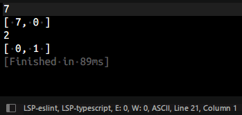

# Use Cases

--8<-- "refs.md"

## Default syntax for new files

Sometimes, mostly in a project, you just want to have this functionality.

For example, you may want a new file[^1] to be auto set to
`JavaScript`, `React` or `Vue` syntax in a frontend web project.

!!! info

    Check the `new_file_syntax` plugin setting.

## Detecting the syntax when modifying the file

This method works only under following circumstances:

- The view's syntax is currently `Plain Text`.
- And the user is modifying either the first line or the last few chars of the file.

A typical use case is that if you create a new file and type `<?php`, the file will automatically
be set to `PHP` syntax because the `PHP` syntax claims it handles files whose first line is `<?php`.

!!! tip

    This also works with user-defined rule so when you copy and paste codes from
    a random website into ST, your defined rule may help you set the syntax too, because you are
    very likely modifying either the first line or the last few characters.

## Trimming unimportant suffixes from the filename

When a file is loaded, this plugin deduces the syntax for your "`Plain Text`" file by its filename.

For example, you may have a configuration file whose name is `parameters.yml.dist`.
ST can't find a syntax for a `.dist` extension so your `parameters.yml.dist` remains `Plain Text`.

However, this plugin will try to remove unimportant suffixes from the filename.
By default, `.dist` is in the `trim_suffixes` list, so this plugin will remove it and try whether
it can find a syntax for `parameters.yml`, and yes, it deserves the `YAML` syntax.

!!! info

    Check `default_trim_suffixes`, `user_trim_suffixes` and `project_trim_suffixes` plugin settings.

## Assigning syntax for Sublime Text syntax test files

Sometimes, the syntax test file just has no file extension so a syntax won't be assigned by Sublime Text.
For example, for the built-in `Git Config.sublime-syntax`, its test file is named as `syntax_test_git_config`.
When you open it, AutoSetSyntax sets the syntax basing on its first line: `# SYNTAX TEST "Git Config.sublime-syntax"`.

## Assigning syntax by the first line

If a file whose name has no `.` and its first line satisfies any of following conditions,

- Has a shebang.
- Has a VIM's syntax line.

this plugin prefers the syntax set by it whenever possible.

This means to fix some corner cases such as a file whose name is `cs` but has a Python shebang.
It will be set to `C#` by ST due to its filename, but the shebang should be precise.

We don't want to overkill that setting a `.erb` (`HTML (Rails)`) template file
back to `HTML` syntax due to its first line.

!!! info

    - ST prefers assigning the syntax basing on the file name (extension) than the first line.
    - If the file name is exactly an extension of a syntax, for example, the file name is `js`,
      ST will use that syntax (which can be wrong). This is how ST detects files who have no extension
      like `Makefile`.

## User-defined rules

- For average users, read "[Configurations][plugin-configurations]" for more details to create your own rules.
- For advanced users, you may read "Advanced Topics" for creating custom `Match` or `Constraint` implementations.

## Machine learning based syntax detection

This can be useful for files which have no extension or irregular extensions, or when pasting codes into a new buffer.
Check [ML-based Detection][plugin-ml-based-syntax-detection].

## Dim out build status from the build output panel

There is a bundled [syntax][plugin-configurations-exec_file_syntax], which dims out unimportant information
such as `[Finished in 89ms]`. When AutoSetSyntax detects there is a build running, it sets the syntax of the
output panel to the bundled one unless the output panel has its own syntax already. Hopefully, this makes
the output less distractive.

If you want to customize the color of unimportant information, their scopes are `comment.status.autosetsyntax.exec`.

[^1]: Create a new file: ++ctrl+n++ for Windows/Linux. ++cmd+n++ for macOS.
